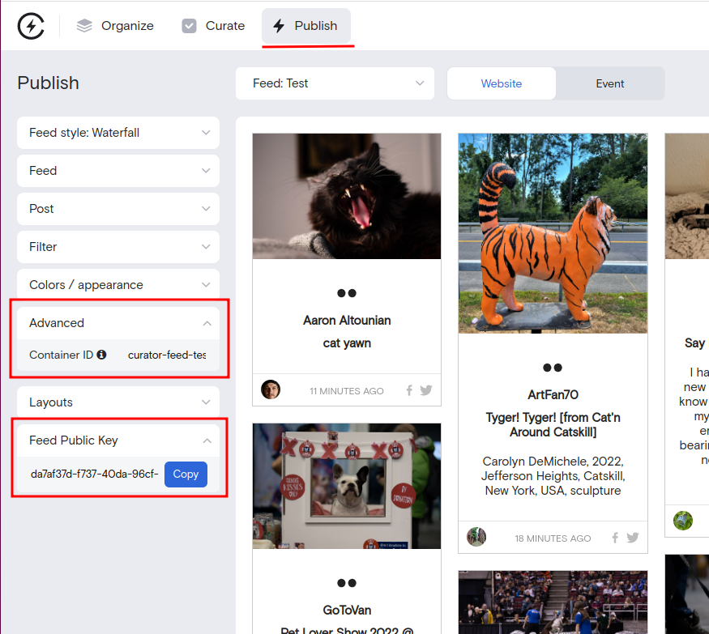

# Documentation

## How to create a Curator element in the CMS

> Audience: content editors, authors and creators

This assumes you have connected up your relevant social accounts in Curator.

### Create a feed in Curator

1. Sign in to your [Curator account](https://curator.io)
1. Create or find your feed following the steps provided in the Curator app
1. Make any changes to the feed you wish by modifying values in the 'Style' section of the feed.
1. Publish your feed

> Curator.io help is available at https://help.curator.io/

## Getting the Feed Id and Container values

This screenshot shows the feed style screen in Curator.io. On this screen you can retrieve the Container ID and Feed Public Key (formerly Feed Id) values.

### Create the feed record in the CMS

If you have permission to access the Curator.io section of your website's CMS, you will see a Curator.io entry in the left menu. If you do not have permission, ask someone who does.

In this section, hit the button "Add Curator.io feed" and enter the following values

1. A title of your feed
1. A description of your feed
1. The Feed Public Key (from the Curator website, as above)
1. The Container ID (from the Curator website, as above)

Save.

### Create the element in the CMS

1. On the relevant page, choose `Add Block`
1. Select the `Curator.io feed widget` and open the resulting element
1. Select a Curator.io feed in the drop down menu provided
1. To preview your changes, save the element in the CMS
1. Optionally publish the CMS element when ready

You can link multiple content blocks to the same feed record across multiple pages.

After completing these steps, the feed will display in the relevant website page.
